  

# Documentation Api-Allopico

## Resources Rest :

- Users : auth, profile (username, email, password, address etc)

  

- Cities : Represent application list cities deserved to shipping (name, coords, ...)

  

- Products : Represent application list product (name , desc, price ...)

  

- Carts : Represent temp user list product (product_ids[] , date)

  

- Commands : Represent user list product validated before payment (Cart_id, date, status) status : (waiting_paid, paid, waiting_shipping, confirmed_shipping, shipping_finish, terminated)

  

- Payments : Represent a command payment (command_id, date, amount , provider (stripe, payplug), provider_extra_data ...)

  

- PaymentNotifications : Represent the Payment provider (stripe, payplug etc) payment notification response

  

- Shippings : Represent Command shipping (user_address, user_id, date_creation, date_estimated_shipping, command_id, date_finish)

## Rest Resources Models:

  

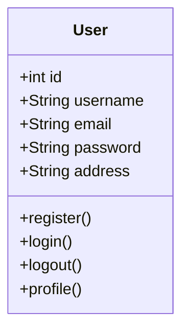
  
  
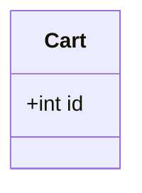
  
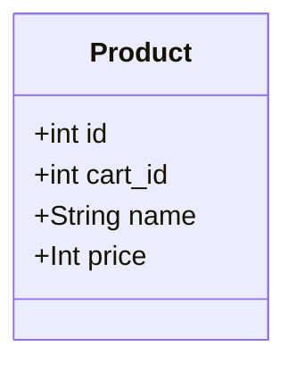
  
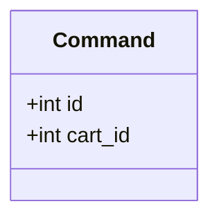
  
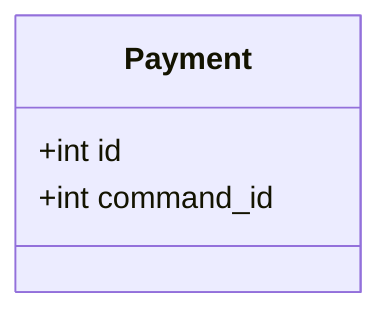
  
  
  
  
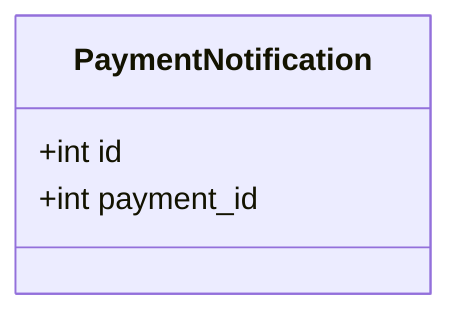

## Liste des servcies:

### api-allopico:

- host: 0.0.0.0:8000

- Swagger: http://0.0.0.0:8000/api/docs/index.html

- bdd:

- dev: dev_api_allopico

  
  

- Description :

>  **Api rest crud des resources** :

> Cities

> Products

> Carts

> Commands

> Payments

> PaymentNotifications

> Shippings

>  **Api User** :

> register

> login

> logout

> profile

>  **Api Payment** :

> initPayment

> finalizePayment

> 3DS

> confirmPaymentNotification : IPN

> confirmPayment

  

## Schema diagram :

ClientApplication : user app / public app

  

User : ClientApplication user

  

AdminApplication : livreur app / private app

  

Admin : AdminApplication user / livreur

  

### Flow Register/login, Gps location, list Products

  

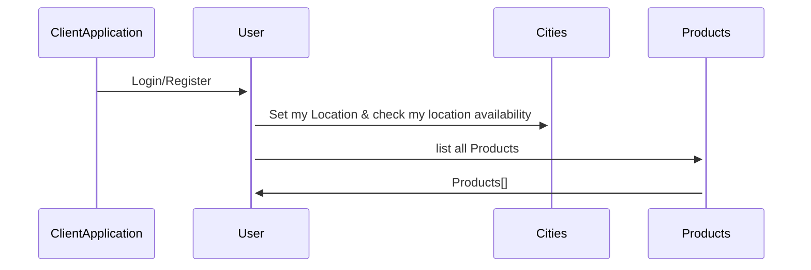

  

### Flow Command and payment : User Side

  

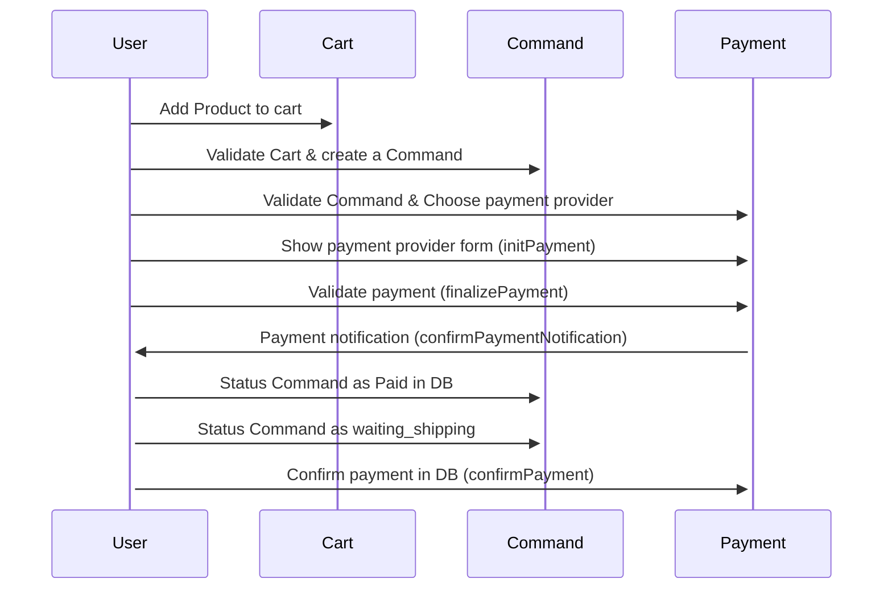

  
  

### Flow Command : Admin Side

  

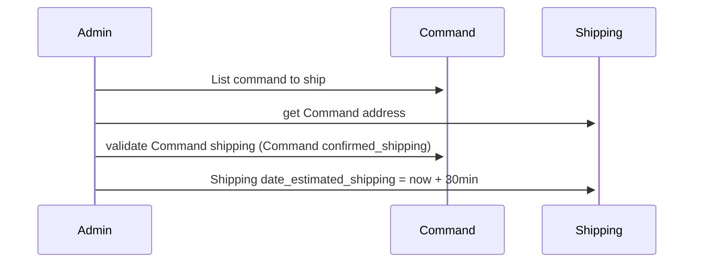

  
  
  

### Flow Shipping : User side

  

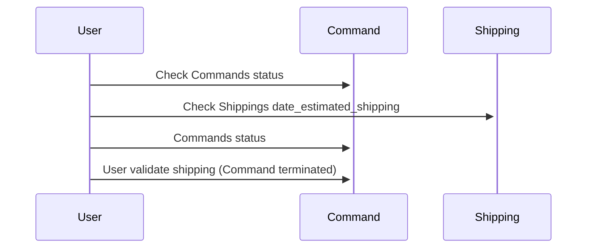

  
  

### Flow Shipping : Admin Side

  

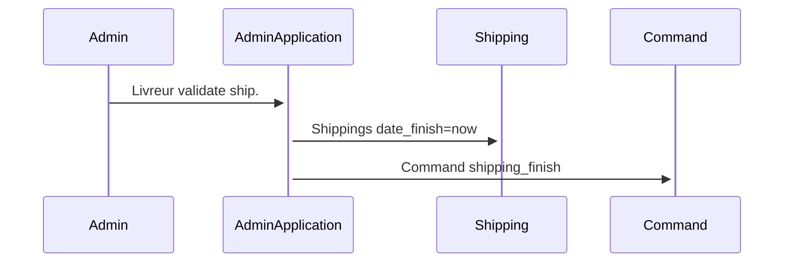