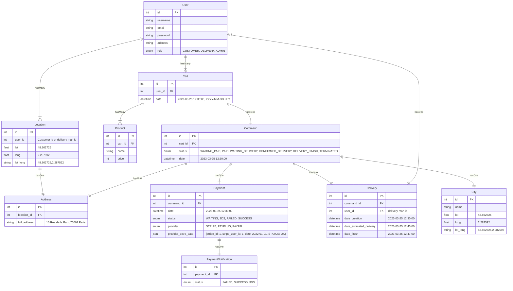
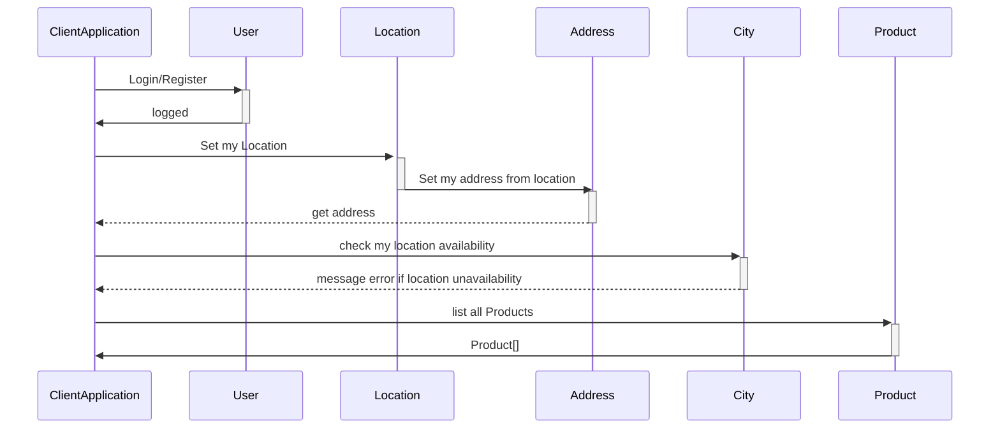
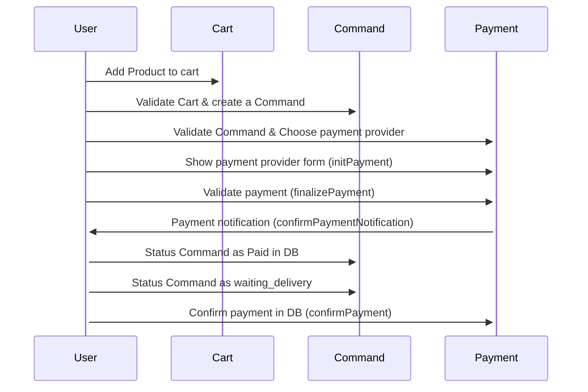
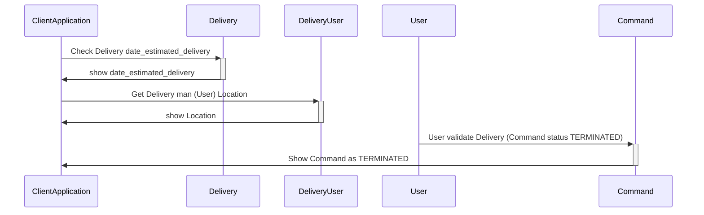
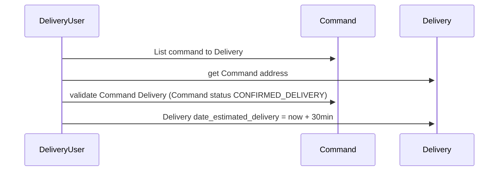
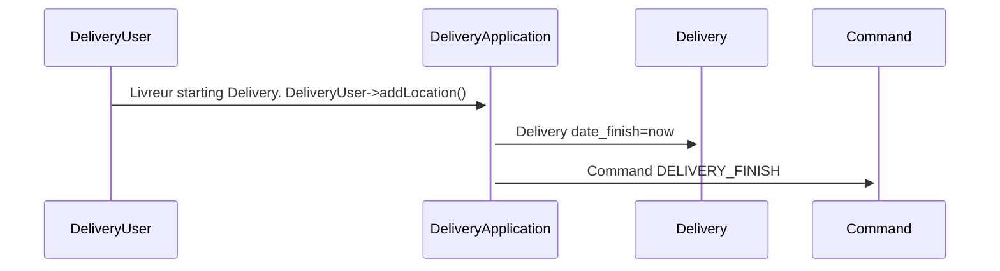

# Documentation Api-Allopico

# DATABASE

## Rest Resources / DB models :

**City** : Represent la liste des villes déservies.

**User** : User auth, profile

**Location** : Represent a gps location. Obtenu grâce au gps du tel. Le user possède une collection de Location.

**Address** : Represent a location address. Addresse complète en une chaine. Obtenu grâce à l'api G+ map à partir des coordonnées. coords -> full address

**Product** : Represent un produit de l'application.

**Cart** : Represent an user list of selected products. temporaire, modififiable ... persisté dans le but d'améliorer l'ux

**Command** : Represent a Cart validated before payment. Panier validé puis stocké en base en vue d'être réglé.

**Payment** : Represent a command payment.

**PaymentNotification** : Represent the Payment provider notification

**Delivery** : Represent Command Delivery

---

[![](https://mermaid.ink/img/pako:eNq9Vu-PsjgQ_lcaPuMu4vpj-WaEfV-y6hrRu2xCYvpC1d4hmFL2XqP-7zelRRA53U9HtNaZp52ZZ6ZTjlqQhESzNMJsijcM7_wYwbNMCUOnU6t1OqJxEmBOkxhZaIvTCY4PEnOR57gTGoYhI2kqYR8xud1phBmv7yLHXKNQM5aEWXADLCEnNEp2OxyHNVMKp3QKOsOHHYl5DVoD2SSiX4Qd7qNGlD9ANFMgx8KRa7-mCadrWiW4tuzimmIn57MEVqHKJeHlUc7FQ8EmDdHsvRSlnNF4g2K8EzvwdZRgjiL4-trL4GnQM_tm19cqqgTQvmY-mYN-99WUKrUJLFsp_WWtXkUKg-fSdq127jsqRBkEvAK5r42ylCc7CB_-JQyFBTOQARAVtqSR_yWq65jkWJTA48AixYEI7u1dGK_kZp1F0QqrvXytbaB5RiBk8AxKh_7WUb9rGCbMGU1rNFcO3rfqQDAsa6GmIDtMoxvpHqfpPwkLbxTK3VJO4myHWBIRkbylt_iYOHMd2c7Y_cOZf-poaE_caaPz6sioTnAU5Pj8EoFMsBQE0BZKBn3ulbVdwFyA7RkNlOB803iOBflVkiqSogTLLKEQc8Ip2BATUUWG2WkZnZbZRW3T6hiWYejoE57WZNKybfTTolYqS-zc1K0euXAdZk5syjHPRHH8OXQX7vTHajZ0bR3JsZCVZI8-pm_ufOLYFVkxW725U9f7qaOFM4eUDBeOLX39RpgNQRU_RcurVOGdCCUTMkiVOfRt-4BtJEVHHdvT0dvQHTtAi7ccjRzPu16zZ8kXDeG0-Jq3mLszR5D4ORsvf8jJcHzB_5VCzyrwK_KbM7wC1zAsPYpTsCfgv4XaOlL_VOnkIhGDhSAEs2W04QPuLIaLpWehj_dz4zFouiQeVcperqmeiStqwNUaGzlHlzTKrWqXz8PyrCbvP84OGG5o2QrafLBWASMy6jupb1hGUpjDJFxdLNY3eOne22BNY5pubxf1qwUP1MZIXsGarsHFBO0yhHepvNx9jW8J9FTNEnFj9rdYdgYcznjiHeJAs9Y4SomuZXthUr1-XaQkpDxhE_l2lr-kFUgn11yAcJdBLWrWUeOHvQBvaMoBHCTxmm6EPGMRiLec71Pr-VmonzaUb7NfT5C255SGW2gu26_X3nPP7A2w2SG9fgd3O50w-NV-HazNl_Y67BttE2vn8_lf7RIc-w?type=png)](https://mermaid.live/edit#pako:eNq9Vu-PsjgQ_lcaPuMu4vpj-WaEfV-y6hrRu2xCYvpC1d4hmFL2XqP-7zelRRA53U9HtNaZp52ZZ6ZTjlqQhESzNMJsijcM7_wYwbNMCUOnU6t1OqJxEmBOkxhZaIvTCY4PEnOR57gTGoYhI2kqYR8xud1phBmv7yLHXKNQM5aEWXADLCEnNEp2OxyHNVMKp3QKOsOHHYl5DVoD2SSiX4Qd7qNGlD9ANFMgx8KRa7-mCadrWiW4tuzimmIn57MEVqHKJeHlUc7FQ8EmDdHsvRSlnNF4g2K8EzvwdZRgjiL4-trL4GnQM_tm19cqqgTQvmY-mYN-99WUKrUJLFsp_WWtXkUKg-fSdq127jsqRBkEvAK5r42ylCc7CB_-JQyFBTOQARAVtqSR_yWq65jkWJTA48AixYEI7u1dGK_kZp1F0QqrvXytbaB5RiBk8AxKh_7WUb9rGCbMGU1rNFcO3rfqQDAsa6GmIDtMoxvpHqfpPwkLbxTK3VJO4myHWBIRkbylt_iYOHMd2c7Y_cOZf-poaE_caaPz6sioTnAU5Pj8EoFMsBQE0BZKBn3ulbVdwFyA7RkNlOB803iOBflVkiqSogTLLKEQc8Ip2BATUUWG2WkZnZbZRW3T6hiWYejoE57WZNKybfTTolYqS-zc1K0euXAdZk5syjHPRHH8OXQX7vTHajZ0bR3JsZCVZI8-pm_ufOLYFVkxW725U9f7qaOFM4eUDBeOLX39RpgNQRU_RcurVOGdCCUTMkiVOfRt-4BtJEVHHdvT0dvQHTtAi7ccjRzPu16zZ8kXDeG0-Jq3mLszR5D4ORsvf8jJcHzB_5VCzyrwK_KbM7wC1zAsPYpTsCfgv4XaOlL_VOnkIhGDhSAEs2W04QPuLIaLpWehj_dz4zFouiQeVcperqmeiStqwNUaGzlHlzTKrWqXz8PyrCbvP84OGG5o2QrafLBWASMy6jupb1hGUpjDJFxdLNY3eOne22BNY5pubxf1qwUP1MZIXsGarsHFBO0yhHepvNx9jW8J9FTNEnFj9rdYdgYcznjiHeJAs9Y4SomuZXthUr1-XaQkpDxhE_l2lr-kFUgn11yAcJdBLWrWUeOHvQBvaMoBHCTxmm6EPGMRiLec71Pr-VmonzaUb7NfT5C255SGW2gu26_X3nPP7A2w2SG9fgd3O50w-NV-HazNl_Y67BttE2vn8_lf7RIc-w)

---

# Api REST 

## api-allopico:

- host: 0.0.0.0:8000

- Swagger: http://0.0.0.0:8000/api/docs/index.html

- bdd:

  - dev: dev_api_allopico

#### **Api resource User** :

> POST /user/register()
> POST /user/login()
> GET/user/logout()

> GET /user/profile()
> PUT /user/profile()

#### **Crud sur les resources suivantes** :

> Resources:

  -  Product 
  -  Cart 
  -  Command 
  -  Delivery

> GET /resource/list 
> POST /resource/create 
> GET /resource/show 
> PUT /resource/update 
> DELETE /resource/delete 
> GET /resource/listFiltered

#### **Api Geo : Location - City - Address** :

api google map
api IGN : https://geoservices.ign.fr/documentation/services/api-et-services-ogc

CRUD:

> GET User Location collection
> POST add Location to User 
> GET Location
> GET Location/all
> POST Location

> GET User Address collection
> POST add Address to User
> GET Address
> GET Address/all
> POST Address

> GET City
> GET City/all
> POST City

AUTRES ENDPOINTS:

> GET /GEO/lat_long_to_address()
> GET /GEO/lat_long_to_city()
> GET /GEO/address_to_city()
> GET /GEO/city_to_lat_long()
> GET /GEO/address_to_lat_long()
> GET /GEO/city_to_address() 
> GET /GEO/address_full_to_address_object() 
> GET /GEO/address_object_to_address_full()

#### **Api resources : Payment - PaymentNotification** :

> initPayment() - finalizePayment() - 3DS() - confirmPaymentNotification() (IPN) - confirmPayment()

---

# Application Flows 

# Diagram Flows : User side

ClientApplication : public Customer application

User : Customer

### Flow Register/login, Gps location, list Products

  

  

### Flow Command and payment 
  

### Flow Delivery 

# Diagram Flows : DeliveryUser side

DeliveryApplication : private livreur application

DeliveryUser : livreur

### Flow Command

### Flow Delivery 

# Diagram Flows : Admin side

AdminApplication : private Admin application

AdminUser : Admin de l'app

