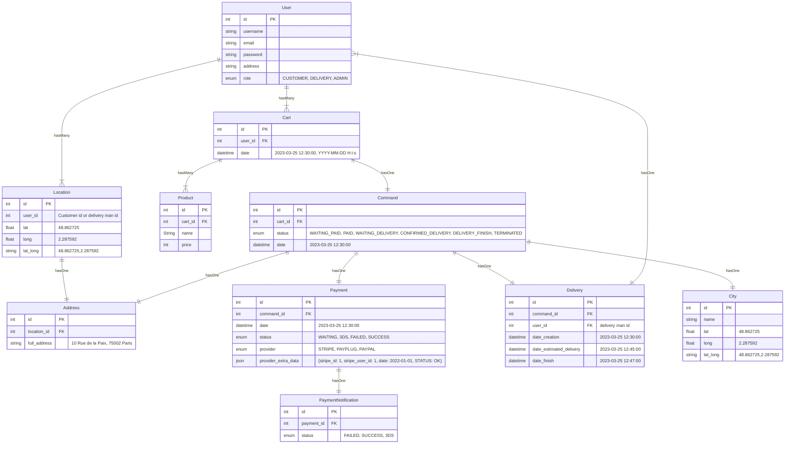
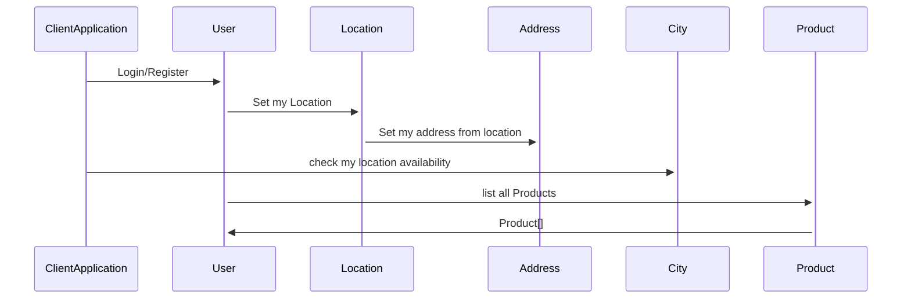
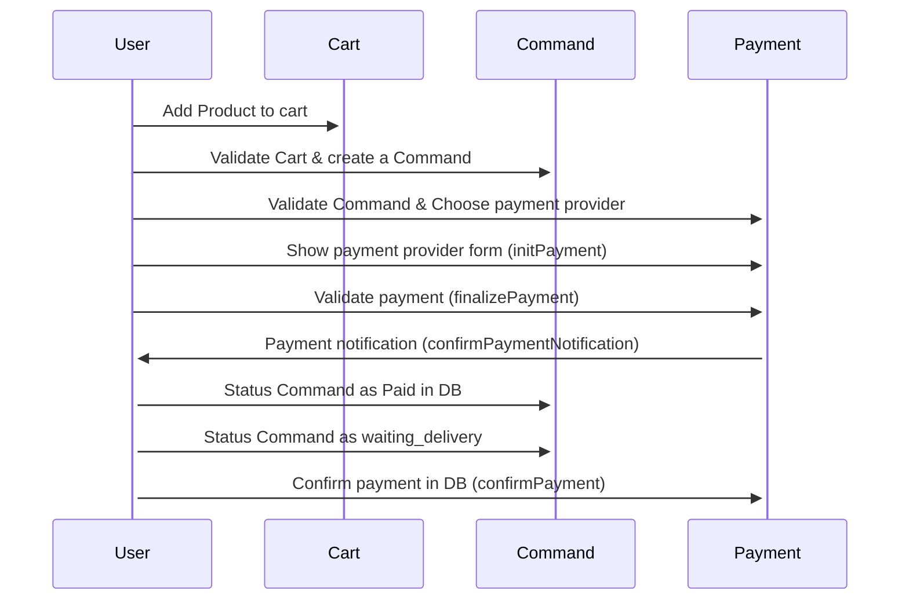
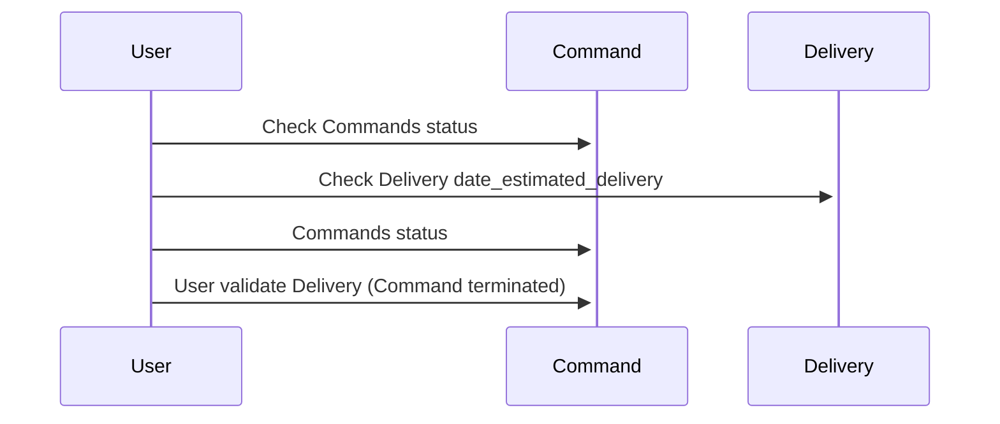
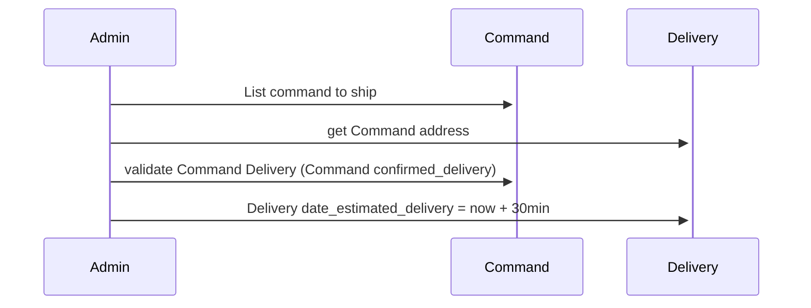
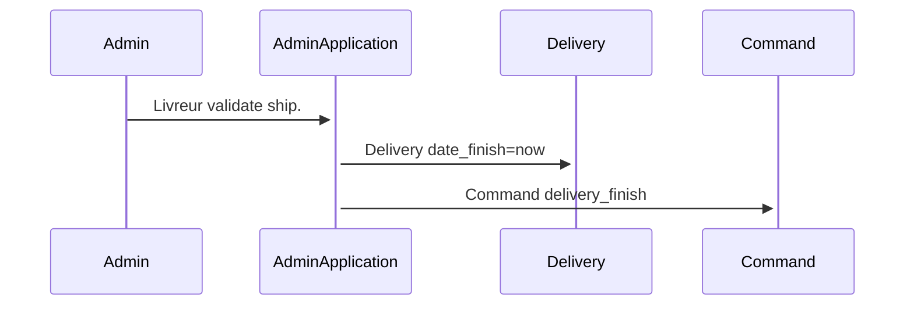

  

# Documentation Api-Allopico

## Rest Resources :

**City** : Represent la liste des villes déservies.  

**User** : User auth, profile 

**Location** : Represent a gps location. Obtenu grâce au gps du tel. Le user possède une collection de Location.

**Address** : Represent a location address. Addresse complète en une chaine. Obtenu grâce à l'api G+ map à partir des coordonnées. coords -> full address

**Product** : Represent un produit de l'application.

**Cart** : Represent an user list of selected products. temporaire, modififiable ... persisté dans le but d'améliorer l'ux

**Command** : Represent a Cart validated before payment. Panier validé puis stocké en base en vue d'être réglé.

**Payment** : Represent a command payment.

**PaymentNotification** : Represent the Payment provider notification

**Delivery** : Represent Command Delivery 

## Liste des servcies:

### Api REST api-allopico:

- host: 0.0.0.0:8000

- Swagger: http://0.0.0.0:8000/api/docs/index.html

- bdd:

  - dev: dev_api_allopico

#### **Api crud des resources suivantes** : 

> City - Address - Location - Product - Cart - Command - Payment - PaymentNotification - Delivery

> list - create - show - update - delete - listFiltered

#### **Api Geo (avec api google map & api IGN : https://geoservices.ign.fr/documentation/services/api-et-services-ogc) : Location - City - Address** :

> lat_long_to_address() - lat_long_to_city() - address_to_city() - city_to_lat_long()

> address_to_lat_long() - city_to_address() - address_full_to_address_object() - address_object_to_address_full() 

#### **Api resource User** :

> register() - login() - logout() - profile()

#### **Api resource Payment** :

> initPayment() - finalizePayment() - 3DS() - confirmPaymentNotification() (IPN) - confirmPayment()

  

# Schema diagram : User side

ClientApplication : user app / public app

User : ClientApplication user

### Flow Register/login, Gps location, list Products

  

  

### Flow Command and payment 
  

### Flow Delivery 

# Schema diagram : Admin side

AdminApplication : livreur app / private app

Admin : AdminApplication user / livreur

### Flow Command

### Flow Delivery 

