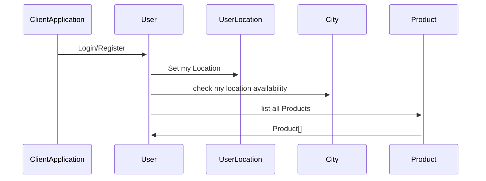
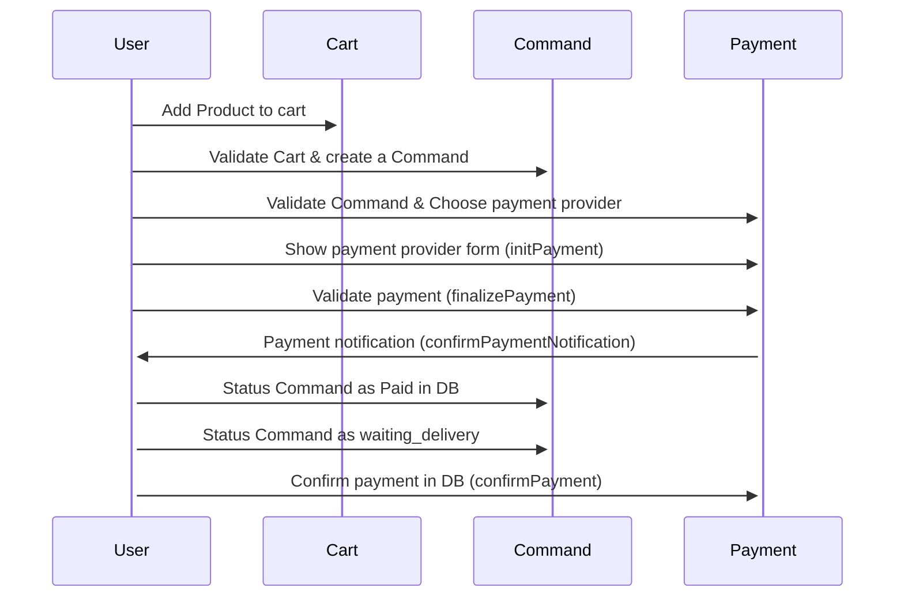
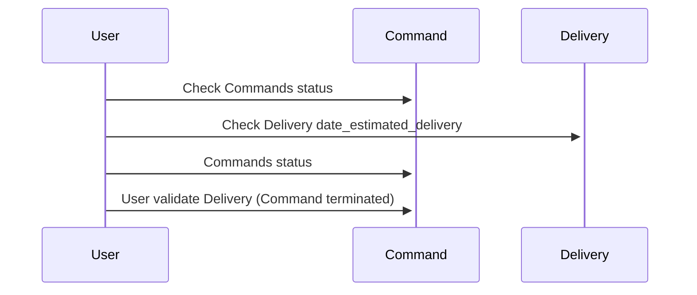
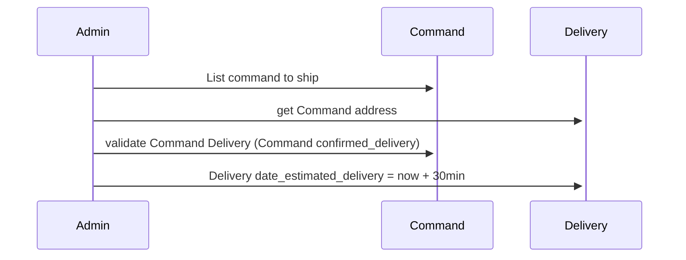
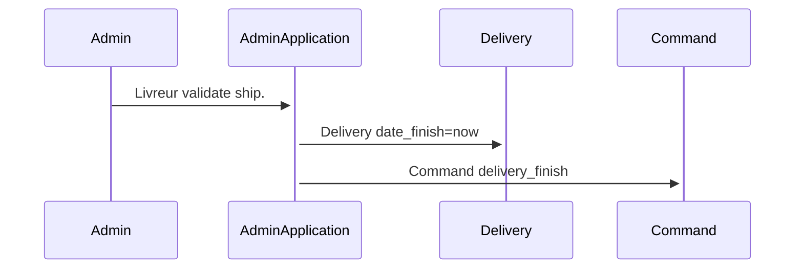

  

# Documentation Api-Allopico

## Rest Resources :

**City** : Represent application list cities deserved for delivery  

**User** : User auth, profile 

**UserLocation** : user gps location 

**Product** : Represent application list product 

**Cart** : Represent temp user list product  

**Command** : Represent user list product validated before payment

**Payment** : Represent a command payment 

**PaymentNotification** : Represent the Payment provider notification

**Delivery** : Represent Command Delivery 


```mermaid  
erDiagram
    User ||--o{ UserLocation : hasMany
    User ||--o{ Cart : hasMany
    
    Cart ||--o{ Product : hasMany
    Cart ||--o{ Command : hasOne
    
    Command ||--o{ Payment : hasOne
    Command ||--o{ Delivery : hasOne
    
    Payment ||--o{ PaymentNotification : hasOne
    
    Command ||--o{ Person : has
        Person ||--o{ PaymentNotification : hasOne
    
    City {
        int id
        string name
        float[] coords
    }
        
    UserLocation {
        int id
        int user_id
        float[] coords
    }
    
    User {
        int id
        string username
        string email
        string password
        string address
    }
    
    
    Product {
		int id  
		int cart_id  
		String name  
		Int price  
	}
    
    Cart {
	     int id
	     int user_id
	     datetime date
	}
    
    Command {
	     int id
	     int cart_id
	enum status
	datetime date
	}
    
    Payment {
	     int id
	     int command_id  
		 datetime date
		 enum status  
		 enum provider   
		 json provider_extra_data
	}
    
    PaymentNotification {
	     int id
	     int payment_id
		 enum status  
	}
	    
    Delivery {
	     int id
	     int command_id  
	     
	     datetime date_creation
	     datetime date_estimated_delivery
	     datetime date_finish
	}
	
 
    
     Person {
        string ex1 PK, FK "The license #"
        string(99) ex2 "Only 99 characters are allowed"
            int id
	     int command_id  
		 datetime date
		 enum status OK, KO "status"
		 enum provider   
		 json provider_extra_data
    }
  
```  


## Liste des servcies:

### Api REST api-allopico:

- host: 0.0.0.0:8000

- Swagger: http://0.0.0.0:8000/api/docs/index.html

- bdd:

  - dev: dev_api_allopico


#### **Api crud des resources suivantes** : 

> City - UserLocation - Product - Cart - Command - Payment - PaymentNotification - Delivery

> list - create - show - update - delete - listFiltered

#### **Api resource User** :

> register() - login() - logout() - profile()


#### **Api resource Payment** :

> initPayment() - finalizePayment() - 3DS() - confirmPaymentNotification() (IPN) - confirmPayment()

  

# Schema diagram : User side

ClientApplication : user app / public app

User : ClientApplication user

### Flow Register/login, Gps location, list Products

  



  

### Flow Command and payment 
  



### Flow Delivery 





# Schema diagram : Admin side

AdminApplication : livreur app / private app

Admin : AdminApplication user / livreur


### Flow Command



### Flow Delivery 


